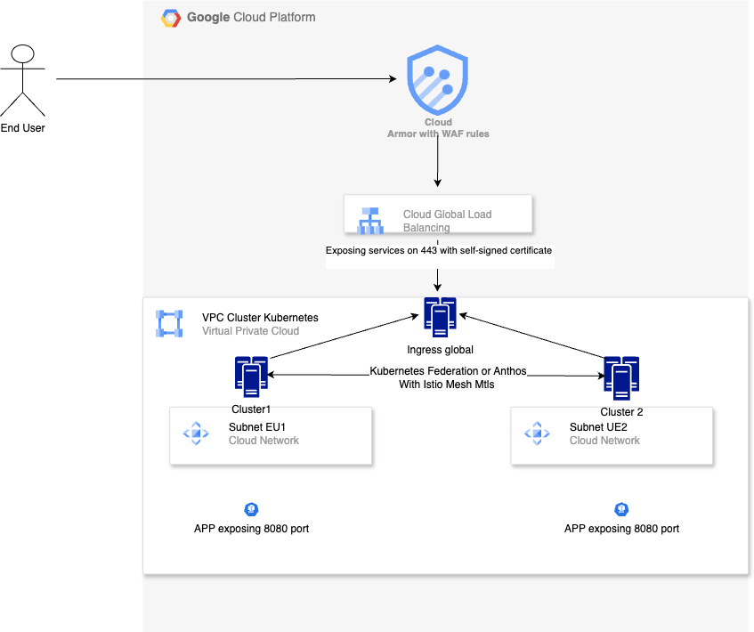
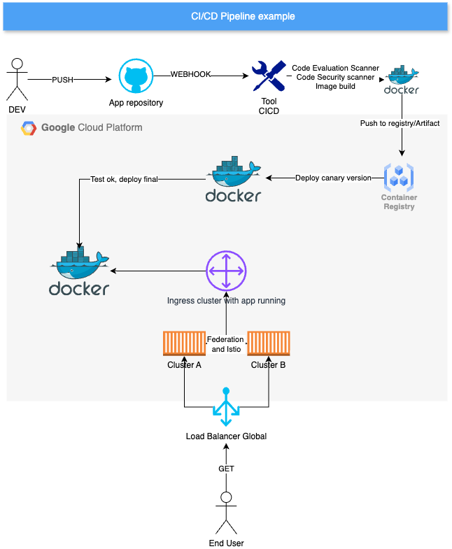

# Estructura del Repositorio

Este repositorio contiene la configuración y despliegue de una aplicación en Google Cloud Platform (GCP) usando Kubernetes, Terraform, ArgoCD, y herramientas como Istio, Prometheus y Grafana.

## Estructura de Directorios

```
./
├── app
│   └── Deployments de la aplicación para ArgoCD
│       ├── Deployment sin canary, exponiendo el servicio por LoadBalancer al puerto 8080 con HPA
│       └── Deployment con canary, exponiendo el servicio en el puerto 443 con certificado autofirmado
├── grafana
│   └── Dashboard de ejemplo para importar como JSON. En la instalación están los predefinidos.
       
└── k8s-manifests
    └── Configuración del repositorio ArgoCD y configuraciones adicionales para el cluster
    ├── Administration-apps.tf
    │   └── Instalación de herramientas de administración del cluster (Prometheus, Grafana, Vault, Kyverno, Istio).
    ├── Artifactory.tf
    │   └── Creación de Artifactory para alojar imágenes Docker.
    ├── Custom-metric.tf
    │   └── Métrica custom para el HPA del pod de ejemplo.
    ├── Docker.tf
    │   └── Creación de la imagen Docker local y push al Artifactory.
    ├── Dockerfile
    │   └── Configuración para el build de la imagen de la aplicación.
    ├── Main.tf
    │   └── Configuración general de los clusters GKE.
    ├── Networking.tf
    │   └── Creación de VPC y subnets para los clusters.
    ├── Outputs.tf
    │   └── Outputs de los objetos creados (endpoint de los clusters, CA, URL Artifactory).
    ├── pipelines-examples-(jenkins/github).txt
    │   └── Prototipo de pipelines.
    ├── Providers.tf
    │   └── Versiones y requerimientos necesarios.
    ├── Terraform.tfvars
    │   └── Variables y habilitación de la instalación de objetos.
    ├── Variables.tf
    │   └── Variables de la configuración.
```

## Instalación

       Resumen de objetos a crear: 
              Repositorio Artifactory
              Build inicial docker
              VPC 
              2 subnets, una por cluster
              2 Clusters Kubernetes
                     └──  Se instalar apps de administracion via terraform/helm


Para poner en marcha este repositorio, sigue los pasos a continuación:

### 1. Clonar el Repositorio

Clona el repositorio en tu máquina local:

```bash
$ git clone https://github.com/mbarbisan91/hd-gcp.git
$ cd hd-gcp
```

### 2. Inicializar Terraform

Inicializa Terraform para descargar los proveedores necesarios:

```bash
$ terraform init
```

### 3. Modificar Variables

Abre el archivo `variables.tf` y modifica las variables con las configuraciones específicas de tu entorno. Luego aplica la configuración:

```bash
$ terraform apply
```

### 4. Obtener Credenciales del Cluster

Obtén las credenciales de tu cluster para poder ejecutar `kubectl` localmente (es el cluster por defecto):

```bash
$ gcloud container clusters get-credentials demo-europe --region europe-west2-a
```

### 5. Aplicar CRDs para ArgoCD

Aplica los CRDs necesarios para ArgoCD desde la consola GCP o de forma local:

```bash
$ kubectl apply -k github.com/argoproj/argo-rollouts/manifests/crds
```

### 6. Copiar el Archivo de GitRepo

Copia el archivo `gitrepo.tf` desde el repositorio:

```bash
$ cp k8s-manifests/gitrepo.tf .
```

### 7. Ejecutar Terraform para Crear ArgoCD

Ejecuta nuevamente Terraform para crear el repositorio de ArgoCD:

```bash
$ terraform apply
```

### 8. Configuración de ArgoCD

Para obtener la contraseña de acceso a ArgoCD:

```bash
kubectl -n argocd get secret argocd-initial-admin-secret -o jsonpath="{.data.password}" | base64 -d; echo
```

Repositorio de la aplicación: ([https://github.com/mbarbisan91/hd-gcp/app](https://github.com/mbarbisan91/hd-gcp/tree/master/app))

**Nota**: Los usuarios y contraseñas fueron creados solo para facilitar la prueba.
Grafana:    
    - Usuario: admin, Contraseña: grafito
    
ArgoCD: 
    - Usuario: admin, Contraseña: Se obtiene via cli kubernetes previamente descripto
    
---

1 - ## Arquitectura



### Descripción

La arquitectura propuesta se basa en la creación de una VPC compartida con subnets separadas por cluster para asegurar alta disponibilidad (HA).
Los despliegues se realizan mediante **ArgoCD**, que instalará todos los servicios necesarios desde los repositorios correspondientes como **Prometheus**, **Grafana**, **Prometheus Adapter**, **Istio**, entre otros.

#### Recovery Time Objective (RTO) y Recovery Point Objective (RPO)

La creacion hasta que la aplicacion este funcionando (ejecucion de terraform y configuraciones posteriores) son alrededor de 20 minutos, con la aplicacion corriendo en un solo cluster. Se podria tomar de referencia para estimar el RTO/RPO pero seria injusto dado que no es una arquitectura redundante como tal.

#### Pasos

1. Se crea una **VPC** compartida entre dos subnets, una por cada cluster.
2. Se despliegan dos clusters en **regiones y zonas diferentes** para cumplir con HA.
3. **ArgoCD** instala todos los servicios necesarios, como **Prometheus**, **Grafana**, **Vault**, **Istio**, etc.
4. El tiempo estimado de despliegue es de aproximadamente 20 minutos.

---

2 - ## Pipeline de CI/CD



### Descripción
Se incluyen ejemplos de código de pipelines para **Jenkins** y **GitHub Actions**. Estos pipelines permiten automatizar el proceso de construcción, prueba y despliegue de la aplicación.

		Flujo de un posible pipeline: 

		Herramientas para CI/CD (Jenkins, GitLab CI, codebuild, github actions): 
		Push del codigo developer --> webhook hacia la app de CI/CD -> pipeline: 
		Pull del codigo nuevo 
		Copilacion de la app 
		Creacion de la app y imagen docker en worker del CI/CD
		Push a la registry/artifact
		Deployment con canary con la nueva version en cluster GKE
			(Si tenemos istio se podria usar el balanceo de carga por porcentaje de request accepted (VirtualService/DestinationRule)
			Rollback en el caso de que la applicacion en el canary no cumpla un X de request y tiempo de respuesta
			(Evaluacion de codigo seguridad, funcionalidad, calidad.)
		Deployment final de la aplicacion. 

		*En caso de tener todos lo ambientes (dev,qa,prod) deberian evaluarse calidad de codigo, seguridad y pruebas de QA/Testing, antes de pasar de ambiente.  
  
### Ejemplos de Pipelines

- `pipeline-example-github-actions`
- `pipeline-example-jenkins-groovy`

---

3 - ## Zero Trust Architecture

La **Zero Trust Architecture** se basa en asegurar que no se confíe en ninguna entidad, ya sea interna o externa, sin verificar su identidad.

### Seguridad

- **mTLS**: Usando **Istio** o cualquier otro service mesh para asegurar la comunicación entre los pods mediante cifrado.
- **GKE**: Clustes con redes privadas, o que sean del tipo confidencial. 
- **Cosign**: Firma de autenticidad de las imágenes Docker.
- **Kyverno**: Auditoría y validación de configuraciones de seguridad y cumplimiento de las reglas de **Pod Security Standards (PSS)**.
- **RBAC**: Uso de roles IAM para la segregación de permisos entre aplicaciones y deployments.
- **WAF**: Aplicacion de reglas Waf al LoadBalancer general o a las instancias expuestas en el global load balancer. Limitando request, y proteccion a inyeccion de codigo, etc. Se podria agregar el uso de **Istio Authorization Policies** podria usarse como una especie de firewall.
- **Audit**: Se podria usar a kyverno internamente, luego obtener el audit log del cluster exportado a prometheus, como asi tambien crear auditoria de los roles iam si estan segredados por aplicativo. 
- **PSP** para la implementacion de PSP se uso Kyverno.

		Obtener politicas de Kyverno:
		$kubectl get cpol

		Politicas aplicadas por defecto aplicadas: 

		NAME                             ADMISSION   BACKGROUND   READY   AGE     MESSAGE
		disallow-capabilities            true        true         True    5m17s   Ready
		disallow-host-namespaces         true        true         True    5m17s   Ready
		disallow-host-path               true        true         True    5m17s   Ready
		disallow-host-ports              true        true         True    5m17s   Ready
		disallow-host-process            true        true         True    5m17s   Ready
		disallow-privileged-containers   true        true         True    5m17s   Ready
		disallow-proc-mount              true        true         True    5m17s   Ready
		disallow-selinux                 true        true         True    5m17s   Ready
		restrict-apparmor-profiles       true        true         True    5m17s   Ready
		restrict-seccomp                 true        true         True    5m17s   Ready
		restrict-sysctls                 true        true         True    5m17s   Ready
  
### Gestión de Secrets

- **GCP Secret Manager** o **Vault** para gestionar secrets y otros valores sensibles.

---

4- ## Mejoras a la Resolución

### Propuestas

1. **Redundancia**: Usar un número impar de nodos (3 o 5 nodos) para mayor disponibilidad.
2. **Federación de Clusters**: Usar **Kubernetes Federation**, **Fleet**, o un **Global Load Balancer**.
3. **DNS**: Crear un **DNS** para la aplicación y exponer el servicio en el puerto 443 con certificado válido.
4. **IAM**: Implementar un control de acceso más fino usando **IAM** por cada aplicación o deployment.
5. **Vault**: Crear un perfil IAM con permisos para usar **KMS** y gestionar secretos de manera segura.
6. **Istio**: Habilitar **Istio** con **mTLS** para asegurar la comunicación entre servicios.
7. **Terraform**: La modularidad del codigo podria mejorarse en modulos.

---
